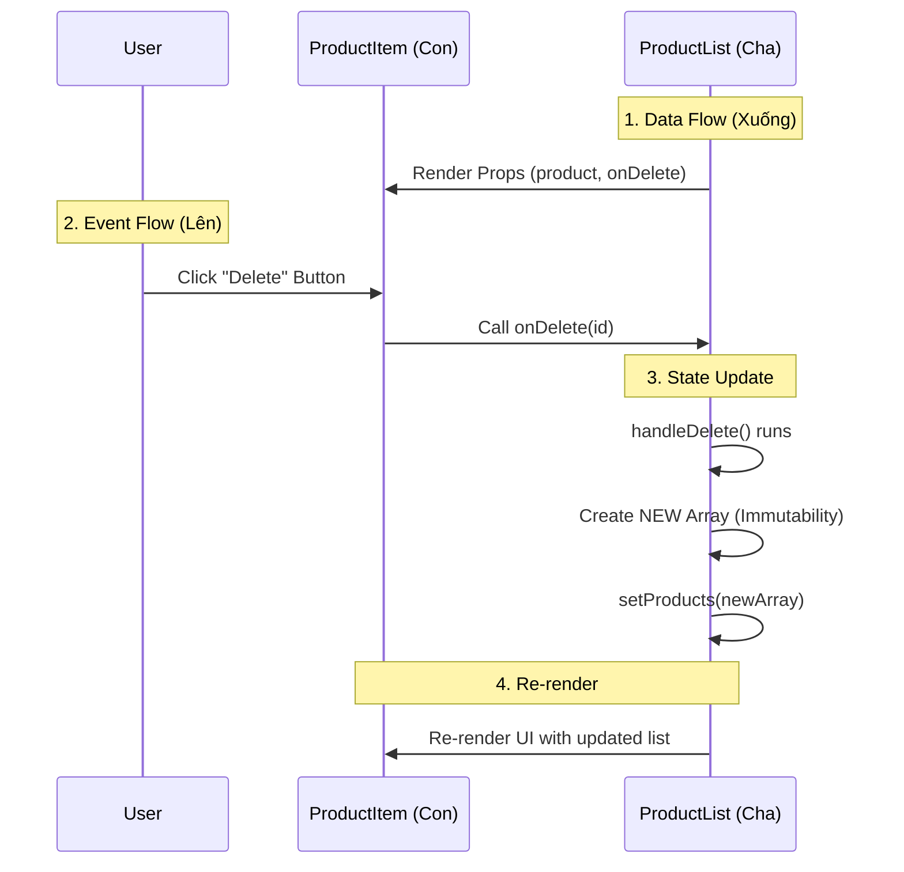

# REACT MASTERY BLUEPRINT: TỪ TƯ DUY OBJECT ĐẾN KIẾN TRÚC ỨNG DỤNG

## GIỚI THIỆU

Tài liệu này được thiết kế dựa trên triết lý: **"React không phải là ma thuật, React là Cấu trúc dữ liệu và Hàm"**. Chương trình tập trung vào việc hiểu sâu bản chất (Deep Dive) thay vì chỉ học cú pháp bề mặt.

## PHẦN 1: LỘ TRÌNH HỌC TẬP CHI TIẾT (SYLLABUS)

### Giai đoạn 1: Bản chất cốt lõi (The Core & Mental Model)

_Mục tiêu: Hiểu những gì xảy ra "dưới nắp capo" trước khi React vẽ lên màn hình._

1. **React Element: Giải phẫu "Tế bào" của React**
    - 1.1. Định nghĩa lại
    - 1.2. Cấu trúc giải phẫu (Anatomy)
2. **Component: Cái máy in Object**
    - 2.1. Ôn tập: Cú pháp hàm chuẩn (Standard Function Syntax)
    - 2.2. Bản chất
    - 2.3. Phân loại `type`
3. **Props & Children: Cơ chế truyền tải**
    - 3.1. Props là bất biến (Read-only)
    - 3.2. Children: Lỗ hổng không gian
4. **Bài tập thực hành (Module 1)**

### Giai đoạn 2: Sự sống của Ứng dụng (State & Interactivity)

_Mục tiêu: Biến các Object tĩnh thành giao diện động._

1. **Tại sao biến thường không hoạt động?**
2. **Hook `useState`: Bộ nhớ của Component**
    - 2.1. Cú pháp chuẩn
    - 2.2. Mental Model: Snapshot (Ảnh chụp)
    - 2.3. Can you use other data types?
    - 2.4. A Warning on Objects & Arrays
3. **Event Handling: Bắt sự kiện đúng cách**
4. **Rendering Lists: Hiển thị mảng dữ liệu**
    - 4.0. Bản chất cốt lõi: Array vs Object
    - 4.1. Sử dụng `.map()`
    - 4.2. Tại sao cần `key`?
5. **Ví dụ tổng hợp (Complex Example)**
    - 5.0. Bài toán và Code mẫu
    - 5.1. Phân tích chi tiết ví dụ (Deep Dive)
    - 5.2. Luồng dữ liệu một chiều (One-way Data Flow)
    - 5.3. Props Destructuring: Hiểu sâu về Input
    - 5.4. Quy tắc đặt tên tham số (Parameter Naming)
    - 5.5. Quy ước đặt tên trong React (Naming Conventions)
    - 5.6. Tóm tắt: 4 Trụ cột React trong ví dụ
6. **Bài tập thực hành (Module 2)**

### Giai đoạn 3: Kết nối thế giới bên ngoài (Side Effects)

_Mục tiêu: Thoát khỏi "hộp kín" của React để tương tác với API, Browser._

1. **Pure Function vs Side Effects**
    - 1.1. Pure Function (Hàm thuần khiết) - Tiêu chuẩn vàng
    - 1.2. Side Effects (Tác dụng phụ) - Những kẻ phá bĩnh
2. **Hook `useEffect`: Nơi trú ẩn của Side Effects**
    - 2.1. Logic hoạt động
3. **Dependency Array: Cái phanh của useEffect**
4. **Cleanup Function: Dọn dẹp chiến trường**
5. **Bài tập thực hành (Module 3)**

### Giai đoạn 4: Kiến trúc và Luồng dữ liệu (Architecture)

_Mục tiêu: Tổ chức code cho ứng dụng lớn, Clean Code._

1. **Lifting State Up: Đưa trạng thái lên cao**
2. **Context API: Đường hầm xuyên không**
3. **Custom Hooks: Vũ khí của chuyên gia**
4. **Bài tập thực hành (Module 4)**

### Giai đoạn 5: Hiệu năng & Hệ sinh thái (Advanced)

1. **Performance: Nghệ thuật của việc "Lười biếng"**
    - 1.1. React.memo: Chiếc khiên bảo vệ
    - 1.2. useMemo & useCallback: Bộ nhớ đệm (Cache)
2. **Forms: Giao tiếp với người dùng**
    - 2.1. Controlled Component (Khuyên dùng)
    - 2.2. Uncontrolled Component
3. **Routing: Ảo thuật chuyển trang (SPA)**
    

## PHẦN 2: TÀI LIỆU CHI TIẾT - MODULE 1: BẢN CHẤT CỦA ELEMENT

### 1. React Element: Giải phẫu "Tế bào" của React

#### 1.1. Định nghĩa lại

React Element không phải là một node HTML thật trên trình duyệt. Nó là một **Plain JavaScript Object** (Object thuần túy) mô tả giao diện.

> **Mental Model:** Hãy coi Element là một "Bản thiết kế" hoặc một "Tờ order món ăn". Bạn đưa tờ order này cho React (đầu bếp), React sẽ làm ra món ăn thật (DOM Node).

#### 1.2. Cấu trúc giải phẫu (Anatomy)

Một Element Object tiêu chuẩn được React tạo ra sẽ có dạng:

```javascript
const element = {
  // 1. Loại danh tính (Identity)
  type: 'div', // Hoặc là function component: type: MyComponent
  
  // 2. Túi dữ liệu (Data bag)
  props: {
    id: 'container',
    className: 'wrapper',
    style: { color: 'red' }, // Style luôn là object (Lưu ý: property dùng camelCase, ví dụ `backgroundColor` thay vì `background-color`)
    
    // 3. Nội dung bên trong (Nesting)
    children: [
        // Chứa các Element Object con khác
        { type: 'span', props: { children: 'Hello' } } 
    ]
  },
  
  // 4. Các định danh đặc biệt (Sẽ học ở Module 2)
  key: null,
  ref: null
};
```

### 2. Component: Cái máy in Object

#### 2.1. Ôn tập: Cú pháp hàm chuẩn (Standard Function Syntax)

Cú pháp chung cho một hàm chuẩn trong JavaScript (và React) tuân theo mẫu sau:

```javascript
function functionName(parameters) {
  // Thân hàm (Body)
  // ... thực hiện công việc ...
  
  return value; // Kết quả trả về
}
```

Giải thích các thành phần:

1. **`function`**: Từ khóa báo hiệu "Tôi sắp định nghĩa một hành động mới."
2. **`functionName`**: Tên bạn đặt cho hàm (ví dụ: `calculateTotal`, `handleClick`).
3. **`(parameters)`**: Các đầu vào (inputs) cần thiết để hàm làm việc. Có thể để trống `()` nếu không cần đầu vào.
4. **`{ ... }`**: "Thân hàm" hay "khối lệnh". Mọi logic code đều nằm trong cặp ngoặc nhọn này.
5. **`return`**: Từ khóa để dừng hàm và gửi kết quả về nơi đã gọi nó.

**Ví dụ 1: Hàm có đầu vào và đầu ra**

Một cỗ máy nhận nguyên liệu và trả về một chiếc bánh.

```javascript
// Input: một số (x)
// Output: trả về một số
function double(x) {
  // 1. Thực hiện công việc (Do some work)
  console.log("Đang tính toán nhân đôi cho số: " + x);
  let result = x * 2;

  // 2. Trả về kết quả (Return result)
  return result;
}

// Sử dụng:
let result = double(5); // result trở thành 10
```

**Ví dụ 2: Hàm không có đầu vào (Tham số rỗng)**

Một cỗ máy chỉ đơn giản là cho bạn biết thời gian.

```javascript
// Input: Không
// Output: trả về chuỗi
function sayHello() {
  return "Hello World!";
}
```

**Ví dụ 3: Hàm không có giá trị trả về (Void)**

Một cỗ máy bật đèn lên nhưng không đưa lại cho bạn thứ gì.

```javascript
// Input: Không
// Output: Không (void)
function turnOnLight() {
  console.log("Light is on");
  // Không có từ khóa return ở đây ngầm hiểu là trả về 'undefined'
}
```

#### 2.2. Bản chất

Component hiện đại là một **Hàm (Function)** bắt buộc có tên bắt đầu bằng **chữ cái in hoa** (ví dụ: `UserCard`).

- **Input:** Nhận vào một object tên là `props`.
    
- **Process:** Xử lý logic, tính toán.
    
- **Output:** Trả về một Element Object (thường viết dưới dạng JSX).
    

#### 2.3. Phân loại `type`

React dựa vào thuộc tính `type` trong Element Object để quyết định hành động:

| **Loại type** | **Giá trị**                    | **Hành động của React**                                                                                             |
| ------------- | ------------------------------ | ------------------------------------------------------------------------------------------------------------------- |
| **DOM Tag**   | Chuỗi String (`'div'`, `'h1'`) | **Vẽ ngay:** Tạo DOM Node tương ứng trên trình duyệt.                                                               |
| **Component** | Hàm Function (`UserCard`)      | **Hỏi tiếp:** Gọi hàm `UserCard(props)` để xem bên trong nó trả về cái gì. Tiếp tục đệ quy đến khi đạt đến DOM Tag. |

### 3. Props & Children: Cơ chế truyền tải

#### 3.1. Props là bất biến (Read-only)

Một nguyên tắc vàng: **Component không bao giờ được sửa đổi `props` của chính nó.** `props` là dữ liệu từ "Sếp" (Component cha) đưa xuống. "Nhân viên" (Component con) chỉ được dùng, không được sửa.

#### 3.2. Children: Lỗ hổng không gian

`children` là một prop đặc biệt giúp tạo ra các Component dạng **Container** (Hộp chứa).

**Best Practice:** Sử dụng `children` để tối ưu hóa việc tái sử dụng layout.

**Ví dụ Code (Tư duy Best Practice):**

```jsx
// 1. Tạo cái Khung (Container)
// Component này không quan tâm nội dung bên trong là gì, chỉ lo cái vỏ.
const Card = ({ children, theme }) => { // Destructuring props trực tiếp
  const style = theme === 'dark' ? { background: '#333', color: '#fff' } : { background: '#fff' };
  return (
    <div className="card-shadow" style={style}>
      {children} {/* Nơi nội dung được bơm vào */}
    </div>
  );
};

// 2. Sử dụng (Implementation)
function App() {
  return (
    <main>
      {/* Tái sử dụng lần 1: Chứa ảnh và text */}
      <Card theme="light">
         
         <h3>User Profile</h3>
      </Card>

      {/* Tái sử dụng lần 2: Chứa form */}
      <Card theme="dark">
         <h3>Login</h3>
         <input type="text" />
      </Card>
    </main>
  );
}
```

### 4. Bài tập thực hành (Module 1)

**Yêu cầu:** Không dùng JSX, hãy dùng `React.createElement` (hoặc viết object literal giả lập) để tạo ra cấu trúc sau. Bài tập này giúp não bộ khắc ghi cấu trúc Object.

**HTML mục tiêu:**

```html
<div id="app">
  <h1 class="title">My App</h1>
  <button onclick="alert('hi')">Click me</button>
</div>
```

**Lời giải (Tư duy Object):**

```javascript
const appElement = {
  type: 'div',
  props: {
    id: 'app',
    children: [
      {
        type: 'h1',
        props: { className: 'title', children: 'My App' }
      },
      {
        type: 'button',
        props: { 
            onClick: () => alert('hi'), // Chú ý: Event trong React dùng camelCase (onClick) khác với HTML (onclick) 
            children: 'Click me' 
        }
      }
    ]
  }
};
```

## PHẦN 3: TÀI LIỆU CHI TIẾT - MODULE 2: STATE VÀ SỰ TƯƠNG TÁC (INTERACTIVITY)

### 1. Tại sao biến thường không hoạt động?

Hãy bắt đầu bằng một sai lầm kinh điển của người mới học. Giả sử ta muốn làm bộ đếm số lần click.

**❌ Cách làm sai (Tư duy Javascript thường):**

```jsx
function Counter() {
  let count = 0; // Biến cục bộ

  function handleClick() {
    count = count + 1;
    console.log(count); // Log ra 1, 2, 3... nhưng màn hình vẫn hiện 0
  }

  return <button onClick={handleClick}>{count}</button>;
}
```

**Tại sao sai?**

1. **Biến cục bộ không tồn tại lâu dài:** Mỗi khi Component render lại (chạy lại hàm `Counter`), biến `count` lại được khởi tạo lại bằng 0.
    
2. **React không biết:** Việc thay đổi biến `count` không kích hoạt cơ chế render lại. React "mù" trước sự thay đổi này.
    

👉 **Giải pháp:** Cần một cơ chế để báo hiệu cho React: _"Dữ liệu thay đổi rồi, hãy chạy lại hàm component và vẽ lại giao diện đi!"_ => Đó là **State**.

### 2. Hook `useState`: Bộ nhớ của Component

`useState` là một Hook (cái móc) giúp Component có thể "ghi nhớ" thông tin giữa các lần render.

#### 2.1. Cú pháp chuẩn

```javascript
const [state, setState] = useState(initialValue);
```

- **`state`**: Biến chứa giá trị hiện tại (Ví dụ: `count` = 0).
    
- **`setState`**: Hàm dùng để cập nhật giá trị **VÀ** kích hoạt React render lại.
    
- **`initialValue`**: Giá trị khởi tạo lần đầu tiên.
    

#### 2.2. Mental Model: Snapshot (Ảnh chụp)

Đây là phần khó hiểu nhất nhưng quan trọng nhất. Hãy khắc cốt ghi tâm câu này:

> **"State updates trigger re-renders." (Cập nhật State sẽ kích hoạt Render lại)**

**Quy trình diễn ra:**

1. **Lần đầu tiên (Mount):**
    
    - React gọi `Counter()`.
        
    - `useState(0)` trả về `[0, setCount]`.
        
    - Component trả về JSX với số `0`.
        
    - React vẽ số `0` lên màn hình.
        
2. **Người dùng bấm nút (Click):**
    
    - Hàm `handleClick` gọi `setCount(1)`.
        
    - React nhận tín hiệu: "À, dữ liệu cũ hỏng rồi, cần vẽ lại".
        
3. **Lần render thứ 2 (Re-render):**
    
    - React gọi lại `Counter()`.
        
    - `useState(0)` lúc này cực thông minh, nó nhớ giá trị cũ là 1, nên trả về `[1, setCount]`.
        
    - Component trả về JSX với số `1`.
        
    - React cập nhật số `1` lên màn hình.
        

#### 2.3. Can you use other data types?

When you write `useState(0)`, you are telling React: **"The initial value of this variable is the number `0`."**

Because JavaScript is dynamic, `count` becomes a **Number**.

**Yes!** `useState` can hold **absolutely anything** that JavaScript supports. It is not limited to numbers.

Here are the most common examples you will use:

##### 1. Text (String)

Used for names, input fields, or messages.

```javascript
const [name, setName] = useState("Phuong");
// usage: setName("Gemini")
```

##### 2. True/False (Boolean)

Used for toggles, switches, or showing/hiding things (like "Dark Mode").

```javascript
const [isMenuOpen, setIsMenuOpen] = useState(false);
// usage: setIsMenuOpen(true)
```

##### 3. Lists (Arrays)

Used for storing lists of data (like a list of tasks or products).

```javascript
const [tasks, setTasks] = useState(["Buy milk", "Clean room"]);
// usage: setTasks([...tasks, "New Task"])
```

*Note: We will talk about that `...` syntax later; it's a special way to add items to arrays in React.*

##### 4. Objects

Used when you have related data (like a user profile).

```javascript
const [user, setUser] = useState({ 
  name: "Phuong", 
  device: "iMac M1" 
});
```

##### 5. Nothing (null)

Used when you are waiting for data to load (like waiting for a stock price to download).

```javascript
const [data, setData] = useState(null);
```

#### 2.4. A Warning on Objects & Arrays

Remember our discussion about **"The New Object"**? This is very important for **Arrays** and **Objects**.

If you have a user object, you **cannot** just change one property like this:

```javascript
// ❌ WRONG: React won't see this change!
user.name = "New Name"; 
setUser(user); 
```

You must give React a **brand new object** for it to recognize the change:

```javascript
// ✅ RIGHT: Create a new object with the new data
setUser({ 
  name: "New Name", 
  device: "iMac M1" 
});
```

### 3. Event Handling: Bắt sự kiện đúng cách

Trong React Element Object, sự kiện (Event) chỉ là một property nằm trong `props`.

**Quy tắc:**

1. Tên sự kiện dùng **camelCase** (`onClick`, `onSubmit`, `onMouseEnter`).
    
2. Truyền vào **Hàm definition** (định nghĩa hàm), không phải gọi hàm ngay lập tức.
    

**✅ Đúng:**

```jsx
<button onClick={handleClick}>Click me</button>
```

_(Dịch: "React ơi, khi nào user click thì hãy gọi hàm này giúp tôi")_

**❌ Sai (Gọi hàm ngay lập tức):**

```jsx
<button onClick={handleClick()}>Click me</button>
```

_(Dịch: "Gọi hàm này ngay bây giờ đi", kết quả trả về của hàm sẽ được gán vào onClick -> Sai logic và có thể gây vòng lặp vô tận)_

#### Ví dụ mã nguồn đầy đủ (Full Simple Example)

Đây là code của một component hoàn chỉnh mà bạn có thể copy để chạy thử:

```jsx
function AlertButton() {
  // Logic xử lý sự kiện
  function handleClick() {
    alert("Xin chào! Bạn đã bắt sự kiện thành công.");
  }

  // JSX trả về
  return (
    <button onClick={handleClick}>
      Bấm vào đây
    </button>
  );
}
```

#### Ví dụ nâng cao: Custom Button với Props & Events

Trong thực tế, bạn sẽ thường xuyên truyền hàm xử lý sự kiện từ Component cha xuống Component con thông qua Props.

```jsx
// 1. Component con (Nhận props)
// Nhiệm vụ: Hiển thị giao diện & báo cáo lại khi được click
function CustomButton({ label, onCustomClick }) {
  // label: "Delete", "Save", ...
  // onCustomClick: Là cái hàm từ cha truyền xuống
  
  return (
    // Nối dây: Sự kiện onClick thật của browser -> gọi hàm onCustomClick của cha
    <button onClick={onCustomClick} style={{ padding: '10px', margin: '5px' }}>
      {label}
    </button>
  );
}

// 2. Component cha (Định nghĩa logic)
// Nhiệm vụ: Quyết định điều gì xảy ra khi con được click
function App() {
  
  const handleDelete = () => {
    alert("Đang xóa dữ liệu...");
  };

  const handleSave = () => {
    console.log("Đã lưu thành công!");
  };

  return (
    <div>
      <h1>Event Handling Demo</h1>
      {/* Truyền hàm handleDelete xuống cho con dùng */}
      <CustomButton label="Xóa" onCustomClick={handleDelete} />
      
      {/* Tái sử dụng: Truyền hàm handleSave xuống */}
      <CustomButton label="Lưu" onCustomClick={handleSave} />
    </div>
  );
}
```

#### Mental Model: Cơ chế "Chuông cửa" (Waiting vs Running)

Hàm `handleDelete` này **không hề chạy liên tục**. Nó đang ở trạng thái **"Chờ lệnh" (Waiting)**.

Hãy tưởng tượng `handleDelete` giống như một cái **Chuông cửa**:

1.  **Dòng code `const handleDelete = ...`**: Giống như việc bạn lắp cái chuông lên tường. Bạn chỉ lắp nó ở đó thôi, lúc này nó **im lặng**.
2.  **Dòng code `<CustomButton ... />`**: Giống như việc bạn dán tờ giấy "Hãy bấm vào đây" lên cái chuông.
3.  **Hành động Click**: Chỉ khi ngón tay người dùng **chạm vào nút**, cái chuông mới kêu (hàm `alert` mới chạy).

**Quy trình thực tế diễn ra như sau:**

1.  **Khởi tạo (Definition):** Khi `App` (Component cha) hiện lên màn hình, nó tạo ra hàm `handleDelete` và giữ nó trong bộ nhớ. Lúc này hàm **chưa chạy**.
2.  **Truyền đi (Passing Props):** Nó đưa hàm này cho `CustomButton` (Component con) thông qua prop `onCustomClick`.
3.  **Gắn sự kiện (Wiring):** `CustomButton` gắn hàm này vào sự kiện `onClick` của thẻ `<button>`.
4.  **Kích hoạt (Trigger):** Người dùng bấm chuột -> Trình duyệt báo "Có click rồi!" -> Hàm `handleDelete` mới được gọi -> **Alert hiện ra**.

#### Khi nào thì một hàm chạy liên tục? (Lỗi thường gặp)

Hàm chỉ chạy liên tục (hoặc tự động chạy ngay lập tức) nếu bạn mắc lỗi viết sai như sau:

**❌ Sai (Chạy ngay khi mở web):**

```jsx
// Nếu bạn viết thêm dấu () ở cuối
<button onClick={handleDelete()} /> 
// handleDelete() -> Dấu () có nghĩa là "Chạy ngay đi!"
// Kết quả: Alert hiện lên ngay khi trang web vừa tải xong, không cần bấm.
```

---

##### Góc chuyên gia: 3 Trạng thái của hàm (Function)

Dưới đây là bảng tổng kết toàn diện về 3 trạng thái của hàm (Function) trong React/JavaScript. Đây là kiến thức cốt lõi để bạn làm chủ việc xử lý sự kiện.

Giả sử chúng ta có một hàm gốc:

```javascript
function nauAn(monAn) {
  console.log("Đang nấu món: " + monAn);
}
```

##### 1. EXECUTION (Thực thi ngay)

* **Cú pháp:** `nauAn('Phở')` (Có dấu ngoặc `()`).
* **Ý nghĩa:** **"CHẠY NGAY ĐI!"**
* **Cơ chế:**
    * Trình duyệt thấy dòng này -> Gọi hàm chạy ngay lập tức.
    * Sau khi chạy xong, nó lấy **kết quả trả về** (return value) để gán vào biến. Nếu hàm không return gì, kết quả là `undefined`.


* **Trong `onClick`:** Đây thường là **LỖI SAI**.
    * `onClick={nauAn()}` -> Nấu ngay khi mở web -> Gán `undefined` vào nút bấm -> Bấm nút không tác dụng.


##### 2. DEFINITION (Định nghĩa / Khai báo mới)

* **Cú pháp:** `() => nauAn('Phở')` (Hàm mũi tên).
* **Ý nghĩa:** **"TẠO QUY TRÌNH MỚI"**.
* **Cơ chế:**
    * Bạn đang tạo ra một cái hộp (hàm ẩn danh) bọc lấy lệnh gọi bên trong.
    * Trình duyệt thấy dòng này -> Nó chỉ tạo cái hộp và để đó, **chưa chạy** ruột bên trong.
    * Chỉ khi nào `onClick` được kích hoạt, nó mới mở hộp ra và chạy lệnh.


* **Trong `onClick`:** Dùng khi cần **TRUYỀN THAM SỐ**.

##### 3. REFERENCE (Tham chiếu / Trỏ tới)

* **Cú pháp:** `nauAn` (Không có dấu ngoặc).
* **Ý nghĩa:** **"ĐƯA ĐỊA CHỈ"**.
* **Cơ chế:**
    * Bạn không gọi hàm, cũng không tạo hàm mới. Bạn chỉ chỉ tay vào cái hàm đã có sẵn trong bộ nhớ.
    * Bạn bảo React: "Đây là địa chỉ của thợ nấu ăn. Khi nào cần thì gọi nó".


* **Trong `onClick`:** Cách **TỐI ƯU NHẤT** (nếu không cần truyền tham số).

---

##### Bảng so sánh tóm tắt

| Đặc điểm | **EXECUTION** (Thực thi) | **DEFINITION** (Định nghĩa) | **REFERENCE** (Tham chiếu) |
| --- | --- | --- | --- |
| **Cú pháp** | `handleDelete()` | `() => handleDelete()` | `handleDelete` |
| **Hình ảnh** | Châm ngòi pháo nổ ngay. | Gói pháo vào hộp quà. | Đưa tấm bản đồ kho báu. |
| **Khi nào chạy?** | **NGAY LẬP TỨC** (khi Render). | **KHI CLICK** (Sự kiện xảy ra). | **KHI CLICK** (Sự kiện xảy ra). |
| **Hiệu năng** | (Không bàn vì logic sai). | Tốn chút bộ nhớ (Tạo hàm mới mỗi lần render). | **Tốt nhất** (Dùng lại hàm cũ). |
| **Truyền tham số** | Có (Nhưng bị lỗi chạy ngay). | **ĐƯỢC** (Cách duy nhất để truyền tham số an toàn). | Không (Chỉ nhận tham số mặc định `event`). |
| **Kết luận** | ❌ **SAI** (Trừ trường hợp đặc biệt). | ✅ **DÙNG** khi cần tham số (ID, index...). | ✅ **DÙNG** cho các nút bấm đơn giản. |

---

##### Ví dụ Code thực tế

Hãy xem sự khác biệt trong một Component:

```javascript
function Menu() {
  
  // Hàm xử lý chung
  const order = (food) => {
    alert("Bạn đã gọi món: " + food);
  }

  // Hàm đơn giản không tham số
  const goHome = () => {
    alert("Đi về!");
  }

  return (
    <div>
      {/* TRƯỜNG HỢP 1: REFERENCE (Chuẩn, gọn gàng) */}
      {/* Dùng khi hàm không cần tham số riêng từ mình */}
      <button onClick={goHome}>
        Về nhà
      </button>

      {/* TRƯỜNG HỢP 2: DEFINITION (Chuẩn, linh hoạt) */}
      {/* Dùng khi BẮT BUỘC phải truyền tham số ("Phở") */}
      <button onClick={() => order("Phở")}>
        Gọi Phở
      </button>

      {/* TRƯỜNG HỢP 3: EXECUTION (LỖI !!!) */}
      {/* Alert "Cơm Tấm" hiện lên ngay khi F5 trang web */}
      {/* Bấm nút này sẽ KHÔNG chạy gì cả */}
      <button onClick={order("Cơm Tấm")}>
        Gọi Cơm (Lỗi)
      </button>
    </div>
  );
}
```

##### Lời khuyên "bỏ túi":

1. Viết `onClick={tenHam}` trước.
2. Nếu thấy báo lỗi thiếu tham số, hoặc cần truyền ID -> Sửa thành `onClick={() => tenHam(id)}`.
3. Tuyệt đối tránh `onClick={tenHam()}`.

**✅ Đúng (Chờ click mới chạy):**

```jsx
// Không có dấu ()
<button onClick={handleDelete} />
// handleDelete -> Có nghĩa là "Đây là cái hàm, giữ hộ tôi, khi nào click thì hãy chạy nó".
```

Vì bạn viết đúng cú pháp (truyền tên hàm, không gọi hàm), nên nó **an toàn** và chỉ chạy khi bạn muốn.

### 4. Rendering Lists: Hiển thị mảng dữ liệu

#### 4.0. Bản chất cốt lõi: Array vs Object

> "Array là Object với tên ngầm định (số thứ tự), còn Object là Array với tên tùy chỉnh."

##### 1. Bản chất cốt lõi (Mental Model)

Hãy tưởng tượng bộ nhớ máy tính là một tủ đựng đồ khổng lồ.

| Đặc điểm | **Array (Mảng) `[...]`** | **Object (Đối tượng) `{...}`** |
| --- | --- | --- |
| **Hình ảnh** | Giống một **đoàn tàu** có đánh số toa. | Giống một **chùm chìa khóa** có dán nhãn. |
| **Tên (Key)** | **Ngầm định (Implicit):** Máy tự đặt là `0, 1, 2, 3...` | **Tùy chỉnh (Custom):** Bạn tự đặt là `"name", "age", "email"...` |
| **Thứ tự** | **Quan trọng:** Toa 1 luôn đứng sau toa 0. | **Không quan trọng:** Chìa khóa "nhà" hay "xe" lấy cái nào trước cũng được. |
| **Mục đích** | Dùng để chứa **danh sách** các thứ giống nhau. | Dùng để mô tả **chi tiết** về một thứ cụ thể. |

##### 2. Chi tiết và Minh họa

###### A. Array (Mảng) - `[...]`

Là một danh sách có thứ tự. Bạn truy xuất dữ liệu bằng **Vị trí** (Index).

* **Cấu trúc thực tế:**
```javascript
const users = ["An", "Bình", "Chi"];
```

* **Cách máy tính "nhìn" nó (Under the hood):**
Nó thực chất là một Object với key là số nguyên:
```javascript
{
  "0": "An",
  "1": "Bình",
  "2": "Chi",
  "length": 3  // Array được "khuyến mãi" thêm thuộc tính này
}
```

* **Khi nào dùng?** Khi bạn cần lưu trữ một tập hợp (list) để sau này lặp qua nó (ví dụ: dùng `.map()` trong React để hiển thị danh sách).

###### B. Object (Đối tượng) - `{...}`

Là một tập hợp các thuộc tính. Bạn truy xuất dữ liệu bằng **Tên nhãn** (Key).

* **Cấu trúc thực tế:**
```javascript
const user = {
  name: "An",
  age: 25,
  role: "Admin"
};
```

* **Cách truy xuất:**
Bạn không hỏi "cho tôi cái thứ nhất", mà bạn hỏi "cho tôi cái `name`".
```javascript
console.log(user.name); // "An"
```

* **Khi nào dùng?** Khi bạn cần lưu trữ thông tin chi tiết của một thực thể duy nhất (ví dụ: thông tin của 1 user, thông tin của 1 setting).

##### 3. Sự kết hợp hoàn hảo (Array of Objects)

Trong thực tế lập trình (đặc biệt là React), chúng ta hiếm khi dùng rời rạc. Chúng ta thường dùng **Mảng chứa các Đối tượng**.

Đây là cấu trúc dữ liệu phổ biến nhất (ví dụ dữ liệu JSON từ API trả về):

```javascript
const userList = [
  // Phần tử 0 (Index 0)
  {
    id: "user_01",   // Custom Key
    name: "An"       // Custom Key
  },
  
  // Phần tử 1 (Index 1)
  {
    id: "user_02",
    name: "Bình"
  }
];
```

**Tại sao cấu trúc này lại mạnh mẽ?**

1. **Vỏ ngoài là Array:** Giúp bạn dùng `.map()` để lặp qua danh sách và tạo ra các thẻ `<li>` hoặc `<div>` (như trong ảnh bạn gửi).
2. **Ruột bên trong là Object:** Giúp bạn truy cập chi tiết (`user.name`, `user.id`) để hiển thị nội dung phong phú.
3. **Vấn đề Reconciliation (React):**
    * React dùng **Vỏ ngoài (Array Index)** để đếm số lượng.
    * Nhưng React cần **Ruột bên trong (Unique ID)** làm `key` để định danh chính xác từng phần tử khi danh sách thay đổi (như tôi đã giải thích ở phần trước).


##### Tóm lại

* Nếu dữ liệu là câu trả lời cho câu hỏi **"Cái nào?"** (Thứ nhất, thứ hai...) -> Dùng **Array**.
* Nếu dữ liệu là câu trả lời cho câu hỏi **"Cái gì?"** (Tên là gì, Tuổi là bao nhiêu...) -> Dùng **Object**.

---

Khi `props.children` là một mảng các Element, React cần một cách để phân biệt chúng.

#### 4.1. Sử dụng `.map()`

Chúng ta dùng hàm `.map()` của Javascript để biến đổi mảng dữ liệu thành mảng Element.

```javascript
const users = ['An', 'Bình', 'Chi'];

// Biến đổi: ['An', 'Bình'] -> [<li>An</li>, <li>Bình</li>]
const listItems = users.map(user => <li>{user}</li>);
```

#### 4.2. Tại sao cần `key`?

React yêu cầu mỗi phần tử trong danh sách phải có props `key` duy nhất.

```jsx
// ✅ Đúng
users.map(user => <li key={user.id}>{user.name}</li>)
```

**Tại sao? (Liên quan đến Reconciliation)** Hãy tưởng tượng danh sách: `[A, B, C]`. Bạn chèn `X` vào đầu: `[X, A, B, C]`.

- **Nếu không có key:** React so sánh theo thứ tự index.
    
    - Vị trí 0: Cũ là A, Mới là X -> React xóa A, vẽ lại X (Tốn kém).
        
    - Vị trí 1: Cũ là B, Mới là A -> React xóa B, vẽ lại A (Tốn kém).
        
    - ... React phải sửa lại toàn bộ danh sách.
        
- **Nếu có key (Ví dụ key="A", key="B"):**
    
    - React nhìn thấy key="A" vẫn còn đó, chỉ bị đẩy xuống dưới.
        
    - React giữ nguyên A, B, C và chỉ chèn thêm X vào đầu.
        
    - **Hiệu năng tăng gấp bội.**
        

### 5. Ví dụ tổng hợp (Complex Example)

#### 5.0. Bài toán và Code mẫu

Kết hợp tất cả kiến thức: Array of Objects + Props + Event Handling + State.

**Bài toán:** Quản lý danh sách sản phẩm.
1. Hiển thị danh sách từ mảng object.
2. Mỗi sản phẩm là một Component riêng (`ProductItem`).
3. Có nút "Xóa" ở mỗi sản phẩm (Child gọi Parent).

```jsx
// --------------------------------------------------------
// 1. Component Con (ProductItem)
// Nhiệm vụ: Chỉ lo việc hiển thị UI cho 1 sản phẩm duy nhất.
// Không cần biết danh sách đến từ đâu, hay xóa như thế nào.
// --------------------------------------------------------
const ProductItem = ({ product, onDelete }) => {
  return (
    <div style={{ border: "1px solid #ddd", padding: "10px", margin: "10px 0" }}>
      {/* Hiển thị thông tin chi tiết từ Object */}
      <h3>{product.name}</h3>
      <p>Giá: ${product.price}</p>
      
      {/* 
        QUAN TRỌNG: Kỹ thuật "Truyền tham số an toàn"
        - Nếu viết: onClick={onDelete(product.id)} -> SAI (Chạy ngay lập tức khi render).
        - Phải viết: onClick={() => onDelete(product.id)} -> ĐÚNG (Tạo hàm bao, chờ click mới chạy).
      */}
      <button onClick={() => onDelete(product.id)} style={{ color: "red" }}>
        Xóa sản phẩm
      </button>
    </div>
  );
};

// --------------------------------------------------------
// 2. Component Cha (ProductList)
// Nhiệm vụ: Nắm giữ dữ liệu (State) và Logic nghiệp vụ (Xóa).
// Là "đầu não" điều khiển mọi thứ.
// --------------------------------------------------------
function ProductList() {
  // KHỞI TẠO STATE:
  // Dùng Mảng chứa các Object để mô tả danh sách.
  // Mỗi Object cần một ID duy nhất để làm Key.
  const [products, setProducts] = useState([
    { id: 1, name: "Laptop Dell", price: 1000 },
    { id: 2, name: "Iphone 15", price: 900 },
    { id: 3, name: "Mouse Logitech", price: 50 },
  ]);

  // LOGIC XÓA (Delete Handler):
  // Tại sao không dùng products.splice()? -> Vì React cần tính BẤT BIẾN (Immutability).
  // Ta phải tạo ra một mảng MỚI hoàn toàn, bỏ đi phần tử cần xóa.
  const handleDelete = (idToDelete) => {
    // .filter() tạo ra mảng mới, chỉ giữ lại những ai có ID KHÁC với idToDelete
    const newProducts = products.filter(item1 => item1.id !== idToDelete);
    // Cấu trúc hàm filter xử lý array-> const newArray = oldArray.filter(item => dieu_kien);
    // 💡 Lưu ý: item1 (ở đây) và item (ở .map() bên dưới) là 2 biến độc lập.
    //    Tên khác nhau để nhấn mạnh: chúng chỉ tồn tại trong phạm vi arrow function của mình.

    // Cập nhật State với mảng mới -> Kích hoạt Re-render
    setProducts(newProducts);
  };

  return (
    <div style={{ padding: "20px" }}>
      <h2>Danh sách hàng hóa ({products.length})</h2>
      
      {/* RENDERING LISTS: */}
      {/* Dùng .map() để biến đổi mảng Data thành mảng Component */}
      {products.map((item) => (
        <ProductItem 
          key={item.id}           // BẮT BUỘC: Giúp React định danh (Dùng ID, đừng dùng index)
          product={item}          // TRUYỀN DATA: Gửi object xuống cho con hiển thị
          onDelete={handleDelete} // TRUYỀN LOGIC: Gửi cái "điều khiển" xuống cho con dùng
        />
      ))}
      
      {/* CONDITIONAL RENDERING: Chỉ hiện khi danh sách rỗng */}
      {products.length === 0 && <p style={{color: 'gray'}}>Hết hàng rồi!</p>}
    </div>
  );
}
```
#### 5.1. Phân tích chi tiết ví dụ (Deep Dive)

Dưới đây là sơ đồ luồng dữ liệu minh họa cho quá trình tương tác giữa cha và con:



#### 5.2. Luồng dữ liệu một chiều (One-way Data Flow)

**CHÍNH XÁC TUYỆT ĐỐI! 💯**

Hãy phân tích cụ thể **cách Cha truyền Con** và **Con truyền Cha** trong ví dụ `ProductList` ở trên. Đây chính là quy tắc **Luồng dữ liệu một chiều (One-way Data Flow)** - triết lý cốt lõi của React:

##### Vế 1: "Cha truyền con Tên Hàm, Con truyền Cha lại Giá trị"

✅ **Phân tích trong code:**

**Bước 1: Cha (ProductList) định nghĩa hàm xử lý**
```jsx
const handleDelete = (idToDelete) => {
  const newProducts = products.filter(item1 => item1.id !== idToDelete);
  setProducts(newProducts);
};
```
👆 Cha tạo ra cái "Loa" (hàm `handleDelete`). Cha nắm giữ toàn quyền quyết định logic xóa.

> **💡 Lưu ý:** Biến `item1` ở đây là hoàn toàn độc lập với biến `item` trong `.map()` bên dưới. Tên khác nhau để nhấn mạnh rằng mỗi biến chỉ tồn tại trong phạm vi arrow function của nó.

**Bước 2: Cha đưa "Loa" cho Con**
```jsx
<ProductItem 
  product={item}
  onDelete={handleDelete}  // ← Đưa TÊN HÀM (không gọi, không có dấu ())
/>
```
👆 Cha chỉ đưa địa chỉ/tên hàm cho Con. Lúc này hàm **chưa chạy**.

**Bước 3: Con (ProductItem) nhận "Loa" và hét vào đó khi cần**
```jsx
const ProductItem = ({ product, onDelete }) => {
  return (
    <button onClick={() => onDelete(product.id)}>  {/* ← Con GỌI hàm + GỬI GIÁ TRỊ */}
      Xóa sản phẩm
    </button>
  );
};
```
👆 Khi user click nút, Con gọi `onDelete(1)` (ví dụ ID = 1). **Con truyền giá trị ngược lên Cha**.

**Bước 4: Cha nhận giá trị và tự xử lý**
```jsx
handleDelete(1) // ← Hàm của Cha chạy, nhận được ID = 1
// Cha tự xóa sản phẩm có ID = 1 khỏi State
```

> **Cơ chế:** Cha đưa cái "Loa" (Hàm). Con hét vào cái "Loa" đó (Gọi hàm + kèm giá trị). Cha nghe thấy và tự sửa đổi State của Cha.

---

##### Vế 2: "Cha truyền Con Giá trị, Con chỉ Hiển thị, không Truyền lại"

✅ **Phân tích trong code:**

**Bước 1: Cha truyền dữ liệu xuống**
```jsx
<ProductItem 
  product={item}  // ← item = { id: 1, name: "Laptop Dell", price: 1000 }
/>
```
👆 Cha gửi object xuống cho Con qua props `product`.

**Bước 2: Con chỉ được đọc và hiển thị**
```jsx
const ProductItem = ({ product }) => {
  return (
    <div>
      <h3>{product.name}</h3>      {/* ← CHỈ ĐỌC và hiển thị */}
      <p>Giá: ${product.price}</p> {/* ← CHỈ ĐỌC và hiển thị */}
    </div>
  );
};
```
👆 Con **không thể** làm thế này:
```jsx
// ❌ SAI - Cố gắng sửa props (React sẽ báo lỗi)
product.price = 900;
```

**Tại sao Con không sửa được?**
* Props là **Read-Only (Chỉ đọc)**.
* Nếu Con muốn "đề nghị" Cha thay đổi giá, Con phải gọi một **callback function** mà Cha đã đưa (giống như `onDelete` ở trên).
* Ví dụ: `onClick={() => onIncreasePrice(product.id, 10)}` → Cha mới là người quyết định có tăng giá hay không.

> **Cơ chế:** Dữ liệu chảy như dòng thác từ trên xuống dưới. Con nhận được props, Con **không thể** sửa props để nó tự chạy ngược lên Cha.

---

##### Hình ảnh tổng kết: Chiếc Tivi và Đài truyền hình

Hãy ánh xạ lại ví dụ `ProductList` vào mô hình Tivi:

* **Cha (ProductList):** Là **Đài truyền hình VTV**.
* **Con (ProductItem):** Là chiếc **Tivi** nhà bạn.

**1. Cha truyền giá trị `product` (Props) → Con:**
* Đài phát sóng dữ liệu `{ name: "Laptop Dell", price: 1000 }`.
* Tivi nhà bạn **chỉ có thể hiển thị** dữ liệu đó: "Laptop Dell - $1000".
* Bạn **không thể** thò tay vào màn hình Tivi sửa giá từ `$1000` thành `$900` để số liệu trên đài thay đổi theo. (Không truyền lại được).

**2. Cha truyền hàm `onDelete` (Callback) → Con:**
* Đài truyền hình cung cấp một số hotline: **"Gọi 1900-XXX để bình chọn xóa sản phẩm"**.
* Bạn (Con) bấm nút "Xóa", giống như gọi hotline và nói: **"Tôi muốn xóa sản phẩm ID = 1!"** (Truyền giá trị ngược lên).
* Lúc này, Đài truyền hình (Cha) nhận thông tin và tự xóa sản phẩm đó khỏi danh sách gốc, sau đó phát sóng lại danh sách mới xuống Tivi.

---

Bạn đã nắm rất chắc kiến thức nền tảng này rồi. Đây là "cửa ải" khó nhất khi mới học React mà bạn đã vượt qua.

---

#### 5.3. Props Destructuring: Hiểu sâu về Input

Trong ví dụ này, bạn thấy `ProductItem` nhận 2 món đồ: **1 object** (`product`) và **1 hàm** (`onDelete`).

Trong React, `ProductItem` là một hàm (Component), và "nguyên liệu đầu vào" (Input) của nó chính là 2 thứ đó.

Tuy nhiên, để hiểu sâu hơn về mặt kỹ thuật (cách máy tính hiểu), mình xin bổ sung về cơ chế "gói hàng" dưới đây:

##### 1. Góc nhìn thực tế (Bạn nhìn thấy)

Đúng như bạn nói, bạn thấy hàm này nhận 2 món riêng biệt:

1. **`product`**: Là một **Object** (chứa thông tin như tên, giá, id...).
2. **`onDelete`**: Là một **Hàm/Function** (công cụ để bấm nút xóa).

##### 2. Góc nhìn kỹ thuật (React hoạt động)

Thực tế, React **không** gửi 2 món rời rạc. React đóng gói tất cả mọi thứ vào **MỘT Object duy nhất** gọi là **`props`**.

Đoạn code:

```jsx
const ProductItem = ({ product, onDelete }) => { ... }
```

Thực chất là cách viết tắt của:

```jsx
// Cách viết tường minh (không viết tắt)
const ProductItem = (props) => { 
    const product = props.product;   // Lấy object product ra
    const onDelete = props.onDelete; // Lấy hàm onDelete ra
    ...
}
```

Kỹ thuật bạn đang dùng gọi là **Destructuring (Bóc tách)**. Tức là:

> *"Tôi biết React gửi đến một cái thùng hàng tên là `props`. Nhưng tôi không muốn cầm cả thùng. Tôi muốn mở thùng ra ngay tại cửa và chỉ lấy đúng 2 món tên là `product` và `onDelete` để dùng thôi."*

##### Tóm tắt Input của ProductItem

| Tên Input | Kiểu dữ liệu (Type) | Nhiệm vụ |
| --- | --- | --- |
| **`product`** | **Object** `{ id, name, price }` | **Dữ liệu để hiển thị**. (Nguyên liệu để nấu ăn). |
| **`onDelete`** | **Function** `(id) => void` | **Công cụ để tương tác**. (Cái nút bấm gọi về Component Cha). |

> [!NOTE]
> Cả 2 món này đều nằm bên trong một object `props` duy nhất. Việc viết `({ product, onDelete })` chỉ là cú pháp destructuring để code gọn gàng hơn.

---

#### 5.4. Quy tắc đặt tên tham số (Parameter Naming)

**Tên của Input của hàm đều là tên tạm?**

Câu trả lời là: **ĐÚNG 95%**.

Hầu hết các trường hợp (như trong `map`, `filter`, hay hàm thông thường), tên Input hoàn toàn là **Tên Tạm** (Placeholder). Bạn thích đặt tên gì cũng được, miễn là dùng nhất quán bên trong hàm.

Tuy nhiên, có **1 trường hợp đặc biệt** trong React mà bạn cần lưu ý (liên quan đến cái ngoặc nhọn `{}`).

Hãy cùng phân tích 2 trường hợp này:

---

##### 1. Trường hợp "Tên Tạm" (Tự do 100%)

Đây là trường hợp của các hàm như: `map`, `filter`, `handleDelete`, hay các hàm xử lý sự kiện `onClick`.

Bạn có thể ví nó như **Cái Phễu**. Cái phễu không quan tâm bạn đổ nước, cát, hay gạo vào. Nó chỉ hứng thứ được đổ vào thôi.

**Ví dụ với `handleDelete`:**

```javascript
// Cách 1: Tên chuẩn
const handleDelete = (idToDelete) => { ... }

// Cách 2: Tên tiếng Việt
const handleDelete = (maSoCanXoa) => { ... }

// Cách 3: Tên ngẫu nhiên
const handleDelete = (cucGom) => { ... }
```

✅ **Tất cả đều chạy đúng.** Vì khi gọi hàm `handleDelete(1)`, số `1` sẽ tự động nhảy vào cái tên mà bạn đã đặt ở vị trí đó.

**Ví dụ với `filter`:**

```javascript
// Bạn viết item1, item2, hay x, y, z đều được
products.filter(x => x.id !== ...) 
```

---

##### 2. Trường hợp "Bắt buộc đúng tên" (Lưu ý đặc biệt)

Đây là trường hợp của **Component React** khi bạn dùng dấu ngoặc nhọn `{ }` để nhận Props (kỹ thuật Destructuring).

Ví dụ: Component `ProductItem`.

**Ở Component Cha (Gửi đi):**
Cha đóng gói 1 thùng hàng, dán nhãn bên ngoài thùng là `product` và `onDelete`.

```jsx
<ProductItem product={...} onDelete={...} />
```

**Ở Component Con (Nhận về):**

**Cách 1: Nhận cả thùng (Tên tạm OK)**
Nếu bạn nhận cả thùng `props`, thì chữ `props` là tên tạm. Bạn đổi thành `thungHang` cũng được.

```jsx
const ProductItem = (thungHang) => { 
    // Phải tự bóc thùng ra: thungHang.product
}
```

**Cách 2: Bóc thùng ngay tại cửa (Destructuring - Phải đúng tên nhãn)**
Đây là cách bạn đang dùng. Khi bạn viết `{ product }`, bạn đang bảo React: *"Hãy tìm trong thùng hàng cái gói tin có nhãn là `product` cho tôi"*.

```jsx
// ✅ ĐÚNG: Tên trùng với nhãn cha gửi
const ProductItem = ({ product }) => { ... }

// ❌ SAI: Tên khác nhãn (React tìm không thấy gói "caiBanh" nào cả -> undefined)
const ProductItem = ({ caiBanh }) => { ... } 
```

##### Tóm tắt quy tắc đặt tên

| Loại hàm | Ví dụ | Quy tắc đặt tên Input |
| --- | --- | --- |
| **Hàm thường** | `handleDelete(id)` | **TỰ DO**. Đặt `id`, `x`, `a` đều được (dựa vào **Thứ tự**). |
| **Callback** | `.map(item => ...)` | **TỰ DO**. Đặt `item`, `sp`, `e` đều được. |
| **Component (Props)** | `({ product })` | **BẮT BUỘC**. Phải trùng tên với key mà Cha gửi xuống (dựa vào **Tên nhãn**). |

> [!IMPORTANT]
> Khi dùng destructuring `{ }` trong React component, tên biến **phải khớp chính xác** với tên prop mà component cha truyền xuống. Đây là điểm khác biệt quan trọng so với hàm thông thường.

---

#### 5.5. Quy ước đặt tên trong React (Naming Conventions)

Dưới đây là bảng tổng hợp "kim chỉ nam" về quy tắc đặt tên trong React. Bạn có thể in ra hoặc lưu lại để dùng cho mọi dự án sau này.

Chúng ta sử dụng 3 kiểu viết chính:

1. **PascalCase:** Viết Hoa Chữ Cái Đầu (Ví dụ: `ProductItem`)
2. **camelCase:** viết thường chữ cái đầu (Ví dụ: `handleDelete`)
3. **SCREAMING_CASE:** VIẾT_HOA_TOÀN_BỘ (Ví dụ: `API_URL`)

---

##### 1. Bảng Tra Cứu Nhanh

| Loại thành phần | Quy tắc viết | Công thức đặt tên | Ví dụ chuẩn |
| --- | --- | --- | --- |
| **Component** | **PascalCase** | Tên danh từ | `ProductList`, `Header`, `UserProfile` |
| **Hàm ở Cha (Logic)** | **camelCase** | `handle` + Động từ | `handleDelete`, `handleSubmit`, `handleChange` |
| **Props ở Con (Event)** | **camelCase** | `on` + Động từ | `onDelete`, `onClick`, `onChange` |
| **Hàm Helper (Nội bộ)** | **camelCase** | Động từ + Danh từ | `calculateTotal`, `formatDate`, `fetchData` |
| **Biến (Data)** | **camelCase** | Danh từ | `user`, `products`, `itemList` |
| **Biến Boolean** | **camelCase** | `is`/`has`/`should` + Tính từ | `isLoading`, `hasError`, `isVisible` |
| **Hằng số (Cố định)** | **SCREAMING** | Tên_Cách_Nhau_Gạch_Dưới | `MAX_ITEMS`, `API_URL`, `VAT_TAX` |

---

##### 2. Giải Thích Chi Tiết & Lý Do

###### A. Component (Cha & Con) → PascalCase

* **Quy tắc:** Luôn viết hoa chữ cái đầu.
* **Lý do:** Để React phân biệt với thẻ HTML (`<div>`, `<span>`).
* **Ví dụ:**
  * ✅ `ProductItem`
  * ❌ `productItem` (Sai, React sẽ tưởng là thẻ HTML lỗi).

###### B. Cặp đôi "Handle - On" (Quan trọng nhất)

Đây là quy tắc giao tiếp giữa Cha và Con.

* **Tại Component Cha (Nơi định nghĩa logic):** Dùng tiền tố **`handle`**.
  * Nó trả lời câu hỏi: *"Tôi xử lý việc gì?"*
  * Ví dụ: `handleDelete` (Tôi xử lý việc xóa).

* **Tại Component Con (Props nhận về):** Dùng tiền tố **`on`**.
  * Nó trả lời câu hỏi: *"Sự kiện nào kích hoạt tôi?"*
  * Ví dụ: `onDelete` (Khi nút xóa được bấm).

###### C. Hàm Helper (Hàm phụ trợ)

Là những hàm tính toán, format dữ liệu, gọi API... nằm bên trong hoặc bên ngoài component.

* **Quy tắc:** Động từ + Danh từ (Làm cái gì + Cho cái gì).
* **Ví dụ:**
  * `calculateTotal()` (Tính tổng)
  * `formatCurrency()` (Định dạng tiền tệ)
  * `checkPermission()` (Kiểm tra quyền)

###### D. Biến & State

* **Biến dữ liệu:** Dùng danh từ. (`products`, `currentUser`).
* **Biến Boolean (Đúng/Sai):** Luôn bắt đầu bằng câu hỏi `is`, `has`, `should`.
  * `isLoading` (Đang tải phải không?) → Đọc code như đọc văn.
  * Tránh đặt tên cụt lủn như: `loading` (Không rõ là trạng thái hay là hành động tải), `flag` (Cờ gì?).

---

##### 3. Ví dụ Code Tổng Hợp (Chuẩn Sách Giáo Khoa)

```javascript
// 1. HẰNG SỐ (Cố định toàn cục) -> SCREAMING_SNAKE_CASE
const MAX_PRODUCT_COUNT = 10;

// 2. COMPONENT (Bắt buộc) -> PascalCase
function ProductManager() {

  // 3. STATE (Biến: Danh từ, Setter: set + Danh từ) -> camelCase
  const [products, setProducts] = useState([]);
  
  // 4. BOOLEAN (Trạng thái) -> is/has...
  const [isLoading, setIsLoading] = useState(false);

  // 5. HELPER FUNCTION (Hàm bổ trợ) -> Verb + Noun
  const calculateTax = (price) => {
    return price * 0.1;
  };

  // 6. HANDLER FUNCTION (Logic xử lý sự kiện) -> handle + Verb
  const handleDelete = (idToDelete) => {
    const newProducts = products.filter(p => p.id !== idToDelete);
    setProducts(newProducts);
  };

  return (
    <div>
      {/* 7. PROPS EVENT (Truyền xuống con) -> on + Verb */}
      <ProductList 
         data={products} 
         onDelete={handleDelete} 
      />
    </div>
  );
}
```

> [!TIP]
> Bạn cứ áp dụng đúng bảng này, code của bạn sẽ cực kỳ chuyên nghiệp, dễ đọc và dễ bảo trì cho cả team!

---

#### 5.6. Mô hình "Data Down, Actions Up" - Tổng hợp Quy chuẩn (The Complete Pattern)

Phần này là bản tổng hợp (Reference Guide) về mô hình giao tiếp giữa Component Cha và Con thông qua **Callback/Props**. Hãy lưu lại để tham khảo khi cần.

##### 1. Nguyên lý cốt lõi

* **Dữ liệu (Data):** Chảy từ trên xuống (Cha → Con) thông qua `props`.
* **Hành động (Actions/Events):** Gửi từ dưới lên (Con → Cha) thông qua việc gọi hàm (Callback).

##### 2. Quy chuẩn đặt tên (Naming Convention)

Để code dễ đọc và dễ bảo trì, cộng đồng React thống nhất quy tắc:

| Vị trí | Tên hàm/Prop | Ý nghĩa | Ví dụ |
| --- | --- | --- | --- |
| **Tại Component Cha** | **`handle`** + `Tên Hành Động` | Hàm này chứa **LOGIC** xử lý. | `handleSave`, `handleChange` |
| **Tại Props (Cầu nối)** | **`on`** + `Tên Sự Kiện` | Tên của cái "dây nối" mà cha đưa xuống. | `onSave`, `onChange` |
| **Tại Component Con** | Gọi `props.`**`on...`** | Con kích hoạt sự kiện để báo cáo/gửi dữ liệu. | `props.onSave(data)` |

##### 3. Cơ chế hoạt động (Luồng chạy)

Quy trình kết nối gồm 3 bước cụ thể:

* **Bước 1 (Tại Cha - Logic):**
  * Cha khai báo một hàm `handle...` (ví dụ: `handleUpdate`).
  * Đây là nơi xử lý dữ liệu cuối cùng (lưu vào state, gọi API...).

* **Bước 2 (Tại Cha - Kết nối):**
  * Trong phần `return` của Cha: Cha gán hàm `handle...` của mình vào một **Prop** (ví dụ: `onUpdate`) của thẻ Con.
  * *Lưu ý:* Cha kết nối vào **Prop**, không kết nối trực tiếp vào hàm nội bộ của con.

* **Bước 3 (Tại Con - Thực thi):**
  * Trong phần `return` (hoặc logic) của Con: Khi sự kiện xảy ra (click, type...), Con gọi `props.onUpdate(value)`.
  * Hành động này "bắn" giá trị `value` ngược lên hàm `handleUpdate` của Cha.

##### 4. Code tổng hợp mẫu

```jsx
// --- COMPONENT CON (Người gửi) ---
function HamCon(props) {
    // Helper function của con (Tùy chọn: dùng để chuẩn bị dữ liệu)
    const chuanBiDuLieu = () => {
        const data = "Dữ liệu từ Con";
        
        // [QUAN TRỌNG] Gọi prop on... để trả value về cho cha
        props.onGuiTin(data); 
    };

    return (
        // Sự kiện click kích hoạt việc gửi tin
        <button onClick={chuanBiDuLieu}>
            Gửi cho Cha
        </button>
    );
}

// --- COMPONENT CHA (Người nhận & Xử lý) ---
function HamCha() {
    // [QUAN TRỌNG] Helper function của Cha: Dùng handle...
    const handleNhanTin = (valueTuCon) => {
        console.log("Xử lý logic với: ", valueTuCon);
    };

    return (
        <div>
            {/* [QUAN TRỌNG] Kết nối: Gán handle (Cha) vào on (Prop) */}
            <HamCon onGuiTin={handleNhanTin} />
        </div>
    );
}
```

##### 5. Đính chính quan trọng

> **ĐÚNG:** Con dùng `on+Name` để trả `value` về cho cha.
> 
> **CHỈNH LẠI:** Trong `return` của Cha, Cha **không nhìn thấy** hàm helper bên trong Con. Cha chỉ nhìn thấy **Props** của Con.
> 
> Do đó, Cha kết nối `helperFunction Cha` → `Props của Con`.

**Giải thích theo 3 bước:**

* **Bước 1 - Logic tại Cha:**
  * Trong code trên, dòng `const handleNhanTin = (valueTuCon) => { ... }` là nơi Cha định nghĩa logic xử lý.
  * Hàm này sẽ nhận dữ liệu từ Con và xử lý (ở đây là in ra console).

* **Bước 2 - Kết nối tại Cha:**
  * Dòng `<HamCon onGuiTin={handleNhanTin} />` chính là Cha "cắm dây" - gán hàm `handleNhanTin` vào **Prop** `onGuiTin`.
  * Lúc này Cha đã tạo "cầu nối" cho Con, nhưng hàm vẫn chưa chạy.

* **Bước 3 - Thực thi tại Con:**
  * Bên trong Con, khi user click button, dòng `props.onGuiTin(data)` được gọi.
  * Thực chất Con đang gọi hàm `handleNhanTin` của Cha (vì Cha đã gán nó vào prop `onGuiTin`).
  * Giá trị `data` từ Con được "bắn" ngược lên Cha qua tham số `valueTuCon`.

> Đây chính là **Callback Pattern**: Cha đưa công cụ (hàm) cho Con, Con dùng công cụ đó để "gọi ngược" lại Cha.

---

#### 5.7. Tóm tắt: 4 Trụ cột React trong ví dụ

Ví dụ `ProductList` và `ProductItem` ở trên tuy ngắn nhưng đã minh họa đầy đủ **4 kiến thức trụ cột** của React:

**1. Data Flow (Dòng chảy dữ liệu - Downwards)**
*   Dữ liệu `products` chỉ được **sống** ở Component Cha (`ProductList`).
*   Component Con (`ProductItem`) muốn có dữ liệu? Cha phải truyền xuống qua `props` (`product={item}`).
*   Con **không được quyền** sửa dữ liệu này. Nó chỉ được đọc và hiển thị.

**2. Event Flow (Dòng chảy sự kiện - Upwards)**
*   Con muốn xóa chính nó, nhưng Con không giữ State, nên Con **không thể tự xóa**.
*   Con phải **"báo cáo"** lên Cha: *"Cha ơi, người dùng muốn xóa thằng có ID là 1"*.
*   Cách báo cáo: Gọi cái hàm mà Cha đã đưa cho lúc trước (`onDelete`).
*   Đây là mô hình **Inverse Data Flow** (Dòng dữ liệu ngược) thông qua Callback Functions.

**3. State Immutability (Tính bất biến)**
*   Trong hàm `handleDelete`, ta **TUYỆT ĐỐI KHÔNG** làm thế này:
    ```javascript
    products.pop(); // SAI! Sửa trực tiếp vào mảng cũ
    setProducts(products); // React sẽ không thấy sự thay đổi vì tham chiếu mảng vẫn như cũ.
    ```
*   Ta phải dùng `.filter()`: Hàm này không sửa mảng cũ, mà nó lẳng lặng tạo ra một **mảng mới** chứa kết quả. Khi React thấy mảng mới này, nó mới chịu cập nhật giao diện.

**4. Key Prop (Định danh)**
*   Dòng `key={item.id}` không phải để cho đẹp. Nó giúp React biết chính xác: *"À, cái thằng Laptop Dell (ID 1) vẫn còn, thằng Iphone (ID 2) bị xóa"*.
*   Nếu dùng `index` làm key, khi xóa thằng đầu tiên, React sẽ bị loạn và phải vẽ lại toàn bộ danh sách, gây lãng phí tài nguyên khủng khiếp.

---

### 6. Bài tập thực hành (Module 2)

**Bài toán:** Tạo một danh sách công việc (Todo List) đơn giản.

1. Có một nút "Thêm công việc".
    
2. Mỗi lần bấm, thêm một dòng "Công việc mới" vào danh sách.
    

**Gợi ý giải (Mental Model):**

- Cần `state` để lưu danh sách: `const [todos, setTodos] = useState([])`.
    
- Sự kiện click sẽ gọi `setTodos` để tạo mảng mới, có thêm phần tử mới.
    
- Dùng `.map()` để render ra `<li>`.
    

```jsx
function TodoApp() {
  const [todos, setTodos] = useState(['Học React', 'Viết Code']);

  const addJob = () => {
    // Lưu ý: Phải tạo mảng mới (Immutability), không dùng .push()
    setTodos([...todos, 'Công việc mới']); 
  };

  return (
    <div>
      <button onClick={addJob}>Thêm việc</button>
      <ul>
        {todos.map((job, index) => (
           // Tạm dùng index làm key vì danh sách đơn giản
           <li key={index}>{job}</li>
        ))}
      </ul>
    </div>
  );
}
```

## PHẦN 4: TÀI LIỆU CHI TIẾT - MODULE 3: SIDE EFFECTS & KẾT NỐI THẾ GIỚI BÊN NGOÀI

### 1. Pure Function vs Side Effects

Trước khi học `useEffect`, bạn cần hiểu React ghét cái gì nhất. React ghét **sự thiếu tinh khiết** trong quá trình render.

#### 1.1. Pure Function (Hàm thuần khiết) - Tiêu chuẩn vàng

Hàm Component `UserCard(props)` được coi là thuần khiết khi:

1. **Cùng đầu vào luôn ra cùng đầu ra:** Đưa `props` A luôn nhận được UI A.
    
2. **Không làm thay đổi bên ngoài:** Không sửa biến toàn cục, không sửa DOM trực tiếp, không gọi API ngầm.
    

#### 1.2. Side Effects (Tác dụng phụ) - Những kẻ phá bĩnh

Side Effect là bất cứ thứ gì làm ảnh hưởng đến thế giới bên ngoài phạm vi của hàm.

- Gọi API lấy dữ liệu.
    
- `document.title = "Hello"`.
    
- `setTimeout`, `setInterval`.
    
- Đăng ký sự kiện `window.addEventListener`.
    

> **Quy tắc sinh tử:** **TUYỆT ĐỐI KHÔNG** viết Side Effect trực tiếp trong thân hàm Component. Vì Component có thể render lại hàng chục lần mỗi giây, Side Effect cũng sẽ chạy lại bấy nhiêu lần (gây crash app, spam API).

---

### 1.3. So sánh triết lý: React (Explicit) vs PHP (Implicit)

Để hiểu sâu hơn tại sao React có những quy tắc nghiêm ngặt như vậy, hãy nhìn vào cuộc chiến triết lý giữa **React (Tư duy hiện đại, Tường minh)** và **PHP (Tư duy Legacy, Ngầm định)**.

#### 1.3.1. Cuộc chiến triết lý: Explicit (Rõ ràng) vs. Implicit (Ngầm định)

Đây là nguyên nhân cốt lõi khiến nhiều lập trình viên hiện đại "ghét" sự ma thuật (magic) của PHP kiểu cũ.

| Đặc điểm | React (Tư duy hiện đại) | PHP (Kiểu cũ / Framework cũ) |
| --- | --- | --- |
| **Dòng dữ liệu** | **Một chiều & Rõ ràng.** Cha truyền cho con qua `props`. Nhìn vào component là biết data từ đâu tới. | **Đa chiều & Ẩn danh.** Data có thể đến từ `global`, `session`, `$_REQUEST`... lơ lửng trong môi trường. |
| **Độ tin cậy** | **Pure (Thuần khiết).** Cùng một đầu vào (Props), luôn ra cùng kết quả (UI). | **Unpredictable (Khó đoán).** Cùng một hàm, chạy lúc này thì đúng, chạy lúc khác thì sai do biến môi trường thay đổi. |
| **Debug** | Dễ. Lỗi ở đâu, nhìn luồng props là ra. | Khó. Phải truy tìm xem biến đó bị thay đổi ở file nào trong hàng chục file `include`. |

#### 1.3.2. Định nghĩa lại "Ma thuật" (Magic)

* **Trong PHP (Kiểu cũ):** "Ma thuật" là những thứ tự động xảy ra mà không cần viết code rõ ràng. Ví dụ: `$_REQUEST` tự động gom `GET`, `POST`, `COOKIE` lại. Nó tiện cho người viết nhanh, nhưng là ác mộng cho người đọc và bảo trì (maintain).
    
* **Trong React:** Không có ma thuật. Mọi thứ đều phải được khai báo. Nếu component cần dữ liệu, nó phải "xin" qua `props` hoặc `hooks`. Mọi thứ đều **Explicit (Tường minh)**.
    

#### 1.3.3. Cơ chế kiểm soát thế giới bên ngoài (Side Effects)

Đây chính là lý do tại sao `useEffect` tồn tại và tại sao nó quan trọng.

**Quy tắc bất di bất dịch:** Component React giống như một **"pháo đài"**.

* **Bên ngoài (Outsider):** Không thể tự ý can thiệp vào nội bộ component, trừ khi đi qua "cổng chính" là **Props**.
    
* **Bên trong (Insider):** Không được tự ý chạy ra ngoài làm loạn (sửa DOM, gọi API lung tung) trong lúc đang tính toán giao diện (Render).
    
* **Vùng đặc biệt (Special Zone):** React dành riêng **MỘT VÀ CHỈ MỘT** vùng cho phép can thiệp bên ngoài: đó là `useEffect`. Vùng này nằm **bên trong** component, nhưng chỉ được phép chạy **SAU KHI** tất cả logic bên trong (tính toán UI) đã hoàn tất.
    

**Vai trò của `useEffect`:**

* Nó là "khu vực cách ly" dành riêng cho các **Side Effects** - nơi duy nhất được phép tác động ra thế giới bên ngoài.
    
* Muốn gọi API? Muốn đổi title trình duyệt? Muốn lắng nghe sự kiện? → **Phải nhốt vào `useEffect`**.
    
* **Thứ tự thực thi quan trọng:** 
  1. Component render (tính toán UI thuần khiết)
  2. React vẽ UI lên màn hình
  3. **SAU ĐÓ MỚI** chạy `useEffect` (can thiệp bên ngoài)
    
* Điều này đảm bảo phần còn lại của component vẫn "Thuần khiết" (Pure) và dễ kiểm soát, đồng thời không làm chặn (block) quá trình render.
    

#### 1.3.4. Kết luận: Tại sao React cảm thấy "tự nhiên" hơn

Lý do nhiều lập trình viên cảm thấy "vibe" được code React/Next.js ngay cả khi chưa rành JavaScript là vì tính **Declarative (Mô tả)** của nó:

> **Code React giống như bản vẽ kỹ thuật:** Nhìn vào là thấy cấu trúc nhà, cửa, phòng ốc (UI structure). Mọi thứ đều rõ ràng, minh bạch.
> 
> **Code PHP kiểu cũ giống như mê cung:** Bạn thấy cái cửa, nhưng không biết mở ra là phòng khách hay... rơi xuống hầm, vì điều đó phụ thuộc vào "phép thuật" ẩn giấu bên dưới.

Đây chính là sức mạnh của **Explicit Programming (Lập trình tường minh)** - nền tảng của React và các framework hiện đại.

---

### 2. Hook `useEffect`: Nơi trú ẩn của Side Effects

`useEffect` là nơi React cho phép bạn thực hiện các Side Effects một cách an toàn **SAU KHI** giao diện đã được vẽ xong.

```javascript
useEffect(() => {
  // Code Side Effect ở đây (Call API, DOM...)
}, [dependencies]); // Mảng phụ thuộc
```

#### 2.1. Logic hoạt động

1. React Render Component (Tính toán UI).
    
2. React Vẽ UI lên màn hình (Browser Paint).
    
3. **SAU ĐÓ**, React mới chạy `useEffect`. -> _Điều này giúp giao diện không bị chặn (block) bởi các tác vụ nặng._
    

### 3. Dependency Array: Cái phanh của useEffect

Tham số thứ 2 của `useEffect` (`[]`) quyết định **khi nào** effect được chạy lại. Đây là phần dễ gây lỗi nhất (Infinite Loop).

| **Dependency Array** | **Ý nghĩa** | **Khi nào chạy?** |
|---|---|---|
| **Không truyền** | `useEffect(() => {})` | Chạy **MỖI LẦN** render (Nguy hiểm, giống code thẳng trong hàm). |
| **Mảng rỗng** | `useEffect(() => {}, [])` | Chạy **DUY NHẤT 1 LẦN** sau khi mount (Giống `componentDidMount`). Dùng để gọi API lần đầu. |
| **Có biến** | `useEffect(() => {}, [userId])` | Chạy lần đầu **VÀ** chạy mỗi khi `userId` thay đổi. |

### 4. Cleanup Function: Dọn dẹp chiến trường

Đôi khi Effect để lại "rác" (như timer đang chạy, kết nối socket đang mở). Nếu Component bị xóa khỏi màn hình (Unmount) mà không dọn rác => **Memory Leak** (Rò rỉ bộ nhớ).

Để dọn dẹp, bạn return một hàm từ trong `useEffect`.

```javascript
useEffect(() => {
  console.log("1. Đăng ký sự kiện Chat");
  const connection = createConnection();

  // Cleanup Function
  return () => {
    console.log("2. Ngắt kết nối Chat (Dọn dẹp)");
    connection.disconnect();
  };
}, [roomId]);
```

**Quy trình:**

1. Người dùng đổi phòng chat (roomId đổi).
    
2. React chạy hàm Cleanup của lần trước (Ngắt kết nối cũ).
    
3. React chạy Effect mới (Kết nối phòng mới).
    

### 5. Bài tập thực hành (Module 3)

**Bài toán:** Đồng hồ đếm ngược và Tiêu đề trang.

1. Hiển thị một đồng hồ đếm ngược từ 10 về 0.
    
2. Đổi tiêu đề tab trình duyệt (`document.title`) thành số giây còn lại.
    
3. Khi về 0 thì dừng lại.
    

**Gợi ý giải (Mental Model):**

- Cần `useEffect` để thiết lập `setInterval`.
    
- Mảng dependency rỗng `[]` để timer chỉ chạy 1 lần lúc đầu? Hay cần cách khác?
    
- Quan trọng: Phải dọn dẹp `clearInterval` khi component unmount để tránh timer chạy ngầm.
    

```jsx
function Countdown() {
  const [count, setCount] = useState(10);

  useEffect(() => {
    // Side Effect 1: Đổi title
    document.title = `Còn lại: ${count}`;
  }, [count]); // Chạy lại mỗi khi count đổi để cập nhật title

  useEffect(() => {
    // Side Effect 2: Timer
    const timerId = setInterval(() => {
      setCount((prevCount) => {
         if (prevCount <= 0) {
             clearInterval(timerId); // Dừng khi về 0
             return 0;
         }
         return prevCount - 1;
      });
    }, 1000);

    // Cleanup: Cực kỳ quan trọng!
    // Nếu user chuyển trang khác, timer phải bị hủy
    return () => clearInterval(timerId);
  }, []); // Chỉ set timer 1 lần lúc mount

  return <h1>{count}</h1>;
}
```

## PHẦN 5: TÀI LIỆU CHI TIẾT - MODULE 4: KIẾN TRÚC VÀ LUỒNG DỮ LIỆU (DATA FLOW)

Trong React, dữ liệu (State) được ví như dòng nước. Nó chỉ chảy một chiều từ trên xuống dưới. Việc hiểu cách điều hướng dòng nước này chính là nghệ thuật tổ chức Code.

### 1. Lifting State Up: Đưa trạng thái lên cao

Đây là mẫu thiết kế (pattern) phổ biến nhất để chia sẻ dữ liệu.

Vấn đề:

Tưởng tượng bạn có 2 component con:

1. `Input`: Để nhập nhiệt độ.
    
2. `Display`: Để hiển thị nước có sôi hay không.
    

Nếu `Input` giữ state `temperature`, thì `Display` làm sao biết nhiệt độ là bao nhiêu để hiển thị? Hai anh em ngang hàng không thể "nói chuyện" trực tiếp.

**Giải pháp:**

- **B1:** Xóa state ở `Input`.
    
- **B2:** Chuyển state đó lên component cha chung (`Calculator`).
    
- **B3:** Cha truyền `state` xuống cho `Display` (qua props) và truyền hàm `setState` xuống cho `Input` (qua props).
    

> **Nguyên lý:** "Single Source of Truth" (Một nguồn sự thật duy nhất). Dữ liệu chỉ nằm ở một chỗ và chảy xuống các nơi cần dùng.

**Ví dụ Code:**

```jsx
// 1. Child Component A: The Input
// It receives the current value and the function to update it via props.
const TemperatureInput = ({ temperature, onTemperatureChange }) => {
    return (
        <fieldset className="border-2 border-gray-300 dark:border-gray-600 rounded-lg p-4">
            <legend className="text-lg font-semibold px-2">Enter temperature in Celsius:</legend>
            <input
                value={temperature}
                onChange={(e) => onTemperatureChange(e.target.value)}
                type="number"
                className="w-full px-4 py-2 border border-gray-300 dark:border-gray-600 rounded-md focus:ring-2 focus:ring-indigo-500 focus:border-transparent dark:bg-gray-700 dark:text-white"
            />
        </fieldset>
    );
};

// 2. Child Component B: The Display
// It receives the temperature via props to decide what to show.
const BoilingVerdict = ({ celsius }) => {
    if (celsius >= 100) {
        return <p className="text-green-600 font-bold text-xl mt-4">The water would boil. 💧🔥</p>;
    }
    return <p className="text-red-600 text-xl mt-4">The water would not boil. ❄️</p>;
};

// 3. The Parent Component: Calculator
// This is where the state "lives" (The Single Source of Truth)
const LiftingStateUpExample = () => {
    // B2: State is initialized here, not in the Input
    const [temperature, setTemperature] = useState('');

    // The handler function that updates the state
    const handleChange = (newTemperature) => {
        setTemperature(newTemperature);
    };

    return (
        <div className="min-h-screen bg-gradient-to-br from-purple-50 to-pink-100 dark:from-gray-900 dark:to-gray-800 p-6 sm:p-8 md:p-12">
            <div className="max-w-3xl mx-auto w-full">
                {/* Back Button */}
                <Link
                    to="/"
                    className="inline-flex items-center text-indigo-600 dark:text-indigo-400 hover:text-indigo-800 dark:hover:text-indigo-300 mb-6 font-semibold"
                >
                    ← Back to Home
                </Link>

                {/* Main Card */}
                <div className="bg-white dark:bg-gray-800 p-8 border-2 border-gray-200 dark:border-gray-700 rounded-xl shadow-2xl">
                    <h1 className="text-3xl font-bold mb-2 text-gray-900 dark:text-white">
                        Lifting State Up Example
                    </h1>
                    <p className="text-gray-600 dark:text-gray-300 mb-6">
                        This example demonstrates how to share state between components by lifting it to their closest common ancestor.
                    </p>

                    {/* B3: Pass the function down to Input */}
                    <TemperatureInput
                        temperature={temperature}
                        onTemperatureChange={handleChange}
                    />

                    {/* B3: Pass the state down to Display */}
                    <BoilingVerdict
                        celsius={parseFloat(temperature)}
                    />

                    {/* Explanation Section */}
                    <div className="mt-8 p-4 bg-indigo-50 dark:bg-gray-700 rounded-lg">
                        <h3 className="font-bold text-lg mb-2 text-gray-900 dark:text-white">💡 Key Concept</h3>
                        <ul className="list-disc list-inside space-y-2 text-gray-700 dark:text-gray-300">
                            <li>The <code className="bg-gray-200 dark:bg-gray-600 px-2 py-1 rounded">temperature</code> state lives in the parent component (Single Source of Truth)</li>
                            <li>The input component receives both the value and the updater function via props</li>
                            <li>The verdict component receives the state to display the result</li>
                            <li>Both child components stay in sync because they share the same state</li>
                        </ul>
                    </div>
                </div>
            </div>
        </div>
    );
};

export default LiftingStateUpExample;
```

#### Giải thích chi tiết: `value={temperature}` - Controlled Component

Trong ví dụ trên, có một dòng code cực kỳ quan trọng mà nhiều người mới học thường bỏ qua:

```jsx
<input
    value={temperature}  // ← Dòng này!
    onChange={(e) => onTemperatureChange(e.target.value)}
/>
```

**Điều gì đang xảy ra?**

Đoạn code này nhằm làm cho **giá trị nhập vào không hiển thị trực tiếp**, mà phải trải qua một "hành trình vòng quanh":

1. **Người dùng gõ số** vào ô input → Sự kiện `onChange` được kích hoạt.
2. **Giá trị mới đi lên cha** (qua hàm `onTemperatureChange`).
3. **Cha cập nhật state** (`setTemperature`).
4. **React render lại component con**.
5. **Giá trị mới đi xuống lại** (qua prop `temperature`).
6. **Cuối cùng mới hiển thị** lên màn hình.

> **Mental Model:** Thay vì ô input tự quản lý giá trị của chính nó (như HTML thông thường), React **chiếm quyền kiểm soát hoàn toàn** (Controlled Component).

---

#### So sánh: Server-side vs Client-side

Đây là sự khác biệt căn bản giữa ngôn ngữ Server-side (như PHP) và Client-side (như React):

| **Đặc điểm** | **HTML Thông thường (PHP, Server-side)** | **React (Client-side)** |
| --- | --- | --- |
| **Cách hoạt động** | Tag `<input>` tự quản lý giá trị của nó. Giá trị nhập vào là giá trị hiển thị. | React kiểm soát giá trị qua `value={state}`. Input chỉ là "màn hình hiển thị". |
| **Khi nào dữ liệu được gửi?** | Cần bấm nút **Submit** hoặc nhấn **Enter** mới push giá trị lên server. | **Real-time**: Mỗi lần gõ phím, giá trị đã được cập nhật ngay lập tức. |
| **Ví dụ (PHP)** | `<form method="POST"><input name="temp"/></form>`<br/>→ Khi submit, `$_POST['temp']` mới nhận được giá trị. | `<input value={temperature} onChange={...} />`<br/>→ Mỗi phím gõ, state `temperature` đã thay đổi ngay. |
| **Tính năng** | Dữ liệu chỉ có trên server sau khi gửi form. | Dữ liệu luôn sẵn sàng trong JavaScript, có thể validate ngay, hiển thị kết quả tức thì. |

**Ví dụ cụ thể:**

- **PHP (Server-side):**
  ```html
  <form method="POST">
    <input name="temperature" />
    <button type="submit">Kiểm tra</button>
  </form>
  ```
  Bạn nhập số 100, nhưng chỉ khi bấm "Kiểm tra", trang web mới reload và PHP mới in ra "Nước sẽ sôi".

- **React (Client-side):**
  Bạn nhập số 100, **ngay lập tức** (không cần bấm gì), dòng chữ "The water would boil 💧🔥" đã hiện ra bên dưới.

---

#### Tại sao phải dùng Controlled Component?

1. **Đồng bộ hóa (Sync):** Đảm bảo giá trị hiển thị trên UI luôn khớp với giá trị trong state. Không có trường hợp "state nói 50 nhưng màn hình hiện 60".

2. **Dễ kiểm soát:** Bạn có thể validate, format, hoặc chặn input không hợp lệ ngay khi người dùng gõ.
   ```jsx
   const handleChange = (newValue) => {
     // Chỉ cho phép số từ 0 đến 200
     if (newValue >= 0 && newValue <= 200) {
       setTemperature(newValue);
     }
   };
   ```

3. **Single Source of Truth:** Dữ liệu chỉ sống ở một chỗ (state), tất cả component khác đều nhìn vào đó. Không có "nhiều nguồn sự thật" gây mâu thuẫn.

---

### 2. Context API: Đường hầm xuyên không

Khi ứng dụng quá lớn, việc truyền props qua 10 tầng (Ông cố -> Ông -> Cha -> Con -> Cháu) được gọi là **Prop Drilling** (Khoan thủng props). Nó làm code cực kỳ rối rắm.

**Giải pháp:** Sử dụng Context để tạo một "đường hầm".

- **Provider (Nguồn phát):** Đặt ở tầng cao nhất, chứa dữ liệu (ví dụ: Theme màu, User đang đăng nhập).
    
- **Consumer/useContext (Nơi nhận):** Component con ở bất kỳ tầng nào cũng có thể "hút" dữ liệu trực tiếp từ đường hầm mà không cần thông qua cha.
    

```jsx
// 1. Tạo Context
const ThemeContext = createContext('light');

// 2. Cung cấp dữ liệu (Ở tầng trên cùng)
<ThemeContext.Provider value="dark">
   <App />
</ThemeContext.Provider>

// 3. Sử dụng dữ liệu (Ở tầng sâu nhất)
const theme = useContext(ThemeContext); // Nhận được "dark" ngay lập tức
```

### 3. Custom Hooks: Vũ khí của chuyên gia

Đến lúc này, bạn thấy Component bắt đầu phình to vì chứa quá nhiều logic (State, Effect, Handler...). Làm sao để tái sử dụng logic này cho component khác?

Giải pháp: Custom Hooks.

Custom Hook thực chất là một hàm Javascript bình thường nhưng có thể gọi các Hook khác (useState, useEffect).

**Quy ước:** Tên hàm bắt buộc bắt đầu bằng `use...` (ví dụ: `useWindowSize`, `useFetch`, `useAuth`).

**Ví dụ:** Tách logic đồng hồ đếm ngược ở Module 3 ra để tái sử dụng.

```javascript
// File: useCountdown.js
function useCountdown(startValue) {
  const [count, setCount] = useState(startValue);

  useEffect(() => {
    const id = setInterval(() => {
       setCount(c => c > 0 ? c - 1 : 0);
    }, 1000);
    return () => clearInterval(id);
  }, []);

  return count; // Trả về dữ liệu cần thiết
}

// File: App.js (Component giờ đây cực gọn)
function App() {
  const count = useCountdown(10); // Gọi 1 dòng là xong
  return <h1>{count}</h1>;
}
```

### 4. Bài tập thực hành (Module 4)

**Bài toán:** Chuyển đổi tiền tệ (Currency Converter).

1. Có 2 ô input: USD và VND.
    
2. Nhập vào ô USD -> Ô VND tự nhảy số (nhân 24000).
    
3. Nhập vào ô VND -> Ô USD tự nhảy số (chia 24000).
    

**Gợi ý giải (Lifting State Up):**

- Đừng để mỗi ô input tự giữ state của mình.
    
- Hãy để component cha giữ 2 state: `amount` (số tiền) và `currency` (đơn vị vừa nhập).
    
- Tính toán giá trị quy đổi ngay trong lúc render (Derived State), không cần lưu 2 state tiền riêng biệt.
    

## PHẦN 6: TÀI LIỆU CHI TIẾT - MODULE 5: HIỆU NĂNG VÀ HỆ SINH THÁI (ADVANCED)

Khi ứng dụng đã chạy đúng, bước tiếp theo là chạy **nhanh** và **mượt**.

### 1. Performance: Nghệ thuật của việc "Lười biếng"

React mặc định rất "chăm chỉ": Khi cha render, tất cả con cái đều render lại theo, dù dữ liệu của con không đổi. Điều này an toàn nhưng tốn kém.

#### 1.1. React.memo: Chiếc khiên bảo vệ

Dùng để bao bọc Component con. Nó sẽ chặn lại việc render nếu `props` đầu vào không thay đổi.

```jsx
const Child = React.memo(({ name }) => {
  console.log("Child render"); // Chỉ log khi 'name' thay đổi
  return <div>{name}</div>;
});
```

#### 1.2. useMemo & useCallback: Bộ nhớ đệm (Cache)

- **`useMemo`:** Cache **giá trị** tính toán (tránh tính lại 1 + 1 = 2 mỗi lần render).
    
- **`useCallback`:** Cache **hàm** (tránh tạo ra hàm mới mỗi lần render, giúp `React.memo` ở con hoạt động đúng).
    

> **Lời khuyên:** Đừng tối ưu sớm (Premature Optimization). Chỉ dùng khi thấy chậm hoặc component quá nặng.

### 2. Forms: Giao tiếp với người dùng

Có 2 cách để xử lý Form trong React:

#### 2.1. Controlled Component (Khuyên dùng)

React nắm quyền kiểm soát hoàn toàn. Dữ liệu trong input luôn đồng bộ với State.

```jsx
const [value, setValue] = useState("");
// Input bị khóa vào state value
<input value={value} onChange={e => setValue(e.target.value)} />
```

#### 2.2. Uncontrolled Component

Dùng `useRef` để "chọc" vào DOM lấy dữ liệu khi cần (giống HTML truyền thống). Dùng cho input file hoặc form quá đơn giản.

### 3. Routing: Ảo thuật chuyển trang (SPA)

Trong React, chúng ta xây dựng **Single Page Application (SPA)**.

- **Web thường:** Bấm link -> Trình duyệt tải trang mới trắng bóc -> Tải lại từ đầu.
    
- **React Router:** Bấm link -> React chỉ **thay đổi Component** ở giữa màn hình. Header/Footer giữ nguyên. Không tải lại trang.
    

```jsx
import { Routes, Route, Link } from "react-router-dom";

// Định nghĩa các tuyến đường
<Routes>
  <Route path="/" element={<Home />} />
  <Route path="/about" element={<About />} />
</Routes>

// Sử dụng Link thay cho thẻ <a>
<Link to="/about">Về chúng tôi</Link>
```

## PHẦN KẾT: TỪ HỌC GIẢ ĐẾN KỸ SƯ

Chúc mừng bạn! Chúng ta đã đi từ những viên gạch cơ bản nhất (Element Object) đến kiến trúc một ứng dụng hoàn chỉnh.

**Tóm tắt hành trình:**

1. **Level 1:** Hiểu Element là Object bất biến.
    
2. **Level 2:** Hiểu Component là Hàm, State là bộ nhớ.
    
3. **Level 3:** Hiểu Side Effect và cách ly nó bằng useEffect.
    
4. **Level 4:** Biết tổ chức dữ liệu (Lifting State, Context) thay vì code lộn xộn.
    
5. **Level 5:** Tối ưu hóa và mở rộng hệ sinh thái.
    

Bước tiếp theo:

Đừng chỉ đọc tài liệu này. Hãy code ngay lập tức. Hãy thử clone lại giao diện Facebook, Instagram hay Trello bằng tư duy này. Sai lầm sẽ là người thầy tốt nhất.

**"Code is read more often than it is written."** - Hãy viết code sao cho đồng nghiệp (và chính bạn trong tương lai) đọc vào là hiểu ngay cấu trúc Object bên dưới.

_Hết tài liệu._